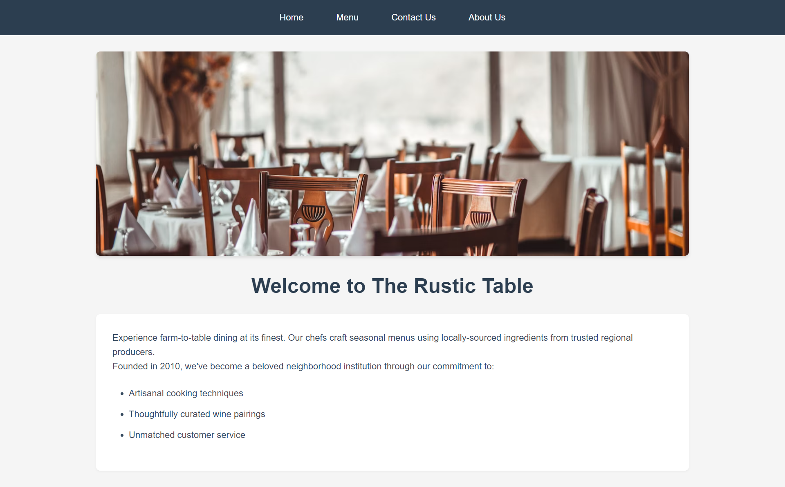

# Restaurant Page

## Overview  

A dynamic **Restaurant Page** built with **HTML, CSS, and JavaScript**, utilizing **Webpack** for module bundling. Developed as part of [The Odin Project](https://www.theodinproject.com/) curriculum, this project emphasizes modularity, JavaScript-driven UI rendering, and a structured approach to web development.

## Features

- **Modular JavaScript** – Organized using separate modules for each page.
- **Webpack Integration** – Bundles all assets efficiently.
- **Tabbed Navigation** – Users can seamlessly switch between sections.
- **Dynamic DOM Manipulation** – The content is generated dynamically using JavaScript.

## Project Structure

```plaintext
restaurant-page/
│-- dist/              # Webpack bundled output
│-- src/               # Source files
│   │-- index.js       # Entry point, manages tab switching
│   │-- template.html  # HTML template for Webpack
│   │-- styles.css     # Global styles
│   │-- modules/       # Contains modular JavaScript files
│   │   │-- home.js    # Home page content
│   │   │-- menu.js    # Menu page content
│   │   │-- contact.js # Contact Us page content
│   │   │-- about.js   # About Us page content
│-- package.json       # Project dependencies and scripts
│-- webpack.config.js  # Webpack configuration
│-- .gitignore         # Ignored files (node_modules, dist)
```

## Technologies Used

- **HTML** – Structuring the page layout.
- **CSS** – Styling the UI.
- **JavaScript (ES6)** – Handles interactivity and DOM manipulation.
- **Webpack** – Manages modules and optimizes assets.

## Future Enhancements  

- **Animations & Effects** – Add smooth transitions and interactive elements.
- **Improved UI Design** – Enhance styles for a more polished look.
- **Persistent State** – Save user-selected tabs across sessions.

## Screenshots

- **Homepage** – Supports Tabbed Navigation.  
    

## Live Demo  

[View on GitHub Pages](https://linzi-v7.github.io/restaurant-page/)  

## Installation & Setup

1. Clone the repository:

   ```sh
   git clone https://github.com/linzi-v7/restaurant-page.git
   cd restaurant-page
   ```

2. Install dependencies:

   ```sh
   npm install
   ```

3. Start the development server:

   ```sh
   npx webpack serve
   ```

4. Open [**http://localhost:8080**](http://localhost:8080) in your browser.

## Acknowledgments  

- **The Odin Project** – For providing the curriculum and project inspiration.  

## License  

This project is licensed under the **MIT License**, meaning you are free to use, modify, and distribute it with attribution. Read the full terms [here](https://github.com/linzi-v7/restaurant-page/blob/main/LICENSE).  

## Contact  

Have feedback or want to collaborate? Feel free to connect:  

- **GitHub** – [linzi-v7](https://github.com/linzi-v7)  
- **LinkedIn** – [Faris Osama](https://www.linkedin.com/in/faris-osama-7a3496303/)  

---

### 📌 Project Status: **Completed** 🚀 (Future improvements planned)
